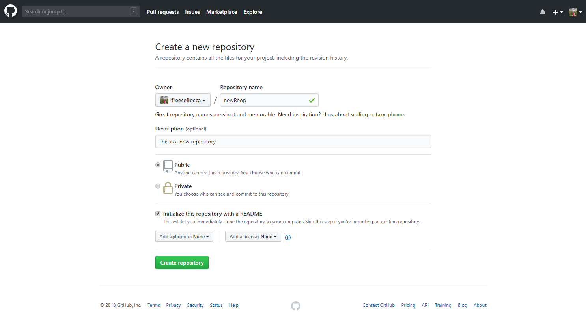
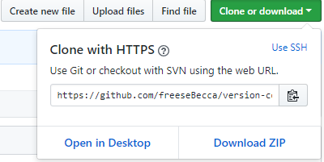
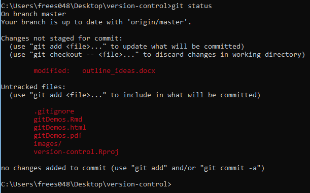
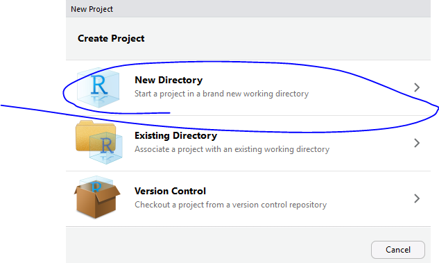
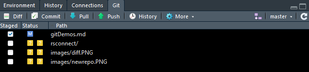
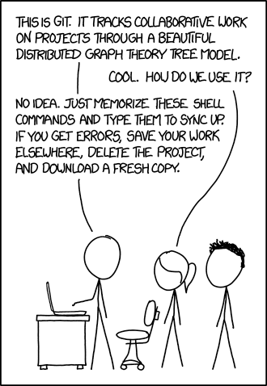
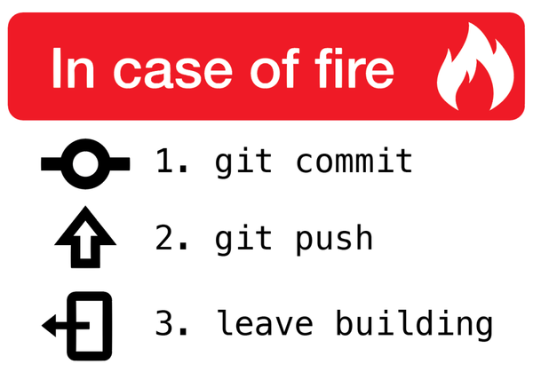

# Introduction 
Here are a few things I've learned about Git and GitHub that I find helpful in my daily workflow. I include links to websites I've used as references. You can find this file on my GitHub page linked above or by searching freeseBecca in GitHub.

First, make sure you have git installed. Type `git --version` in a terminal window to see if you already have it. If not, you will need to [install git](https://git-scm.com/downloads). Mac usually come with it, but it may be an older version you might want to think about updating. 

#Starting and Cloning a repository from GitHub
Starting a new repository from GitHib is easy. Once you have it, you need to clone it to your local machine to start working with it. You could also clone an exhisting repository, say one a collaborator already has, if you start working on something already under version controls. 

  1. Log into GitHub and click **New repository**
  
  2. Fill in the information. I usually initialize by repo with a read me. 
  
  
  
  3. Click **Create repository**
  
  4. From inside yout new repo, click **Clone or download**. Copy the HTTPS URL. It should look something like this:
  
  
  
  5. Open a terminal window and navigate to where you want the repo to live on your local machine
      you can use `cd` to get to the correct locaiton, and `ls` or `dir` for mac or pc to view the files in a specific location.
  
  6. Type `git clone https://github.com/YOUR-USERNAME/YOUR-REPOSITORY` and paste the URL you copied earlier
  
  7. Hit enter. Done!

[Cloning a repository](https://help.github.com/articles/cloning-a-repository/)

#So you have a repo, now what?
You can track pretty much anything. Let's start a new R script and push it to GitHub.

  1. Create a new R project within the local repo and start a new R script. 
  
  2. Write some code and save the file. 
  
  3. In a terminal window, navigate to your repository and type `git status`. You need to tell Git to start tracking files in the **Untracked files** section. 
  
  
  
  4. Type `git add` followed by the name of the file you want to track. Example: `git add gitDemos.Rmd`
      Once a file is being tracked, you can work on it and periodcally commit and push your work to GitHub. 
      
  5. Adding a file tells Git which files to commit. Type `git commit -m "add more details"` where after **-m** you give a short description of the work you did. It is good practive to commit frequently, as that will make it easier to identify bugs/mistakes and change just that portion of your code.
  
  6. Type `git push` to push your changes to GitHub. Done! It's usually good to type `git pull` before starting work on something if working with collaborators. This will pull any changes they have made and update your local copy.
  
#Starting a new repository from R Studio and pushing to GitHub
R Studio now has pretty good capabilities to work with git!

  1. Start a new project. I usually don't choose the Version Control option here.
  

  2. In the terminal window of R Studio, type `git status`. This will tell you that this is not a git repository

  3. Type `git init` which initializes the project as a git repo.

  4. Close and reopen the project, and you should see a **Git** tab by the Environment window. 
  
  

#Working with the R Studio IDE
Now you're using git through R Studio! I find that knowing the basics of using git through the command line and then through R Studio is sufficient for my needs, but there are other really good git clients out there if you need something further than R Studio. I recommend [Source Tree](https://www.sourcetreeapp.com/) if you want to give somethine else a try.

#In summary 

1. Initialize or clone a repo on your local machine.

2. Work on the project

3. Pull changes (especially when working with collaborators)

4. Add/stage your changes

5. Commit changes

6. Push changes

